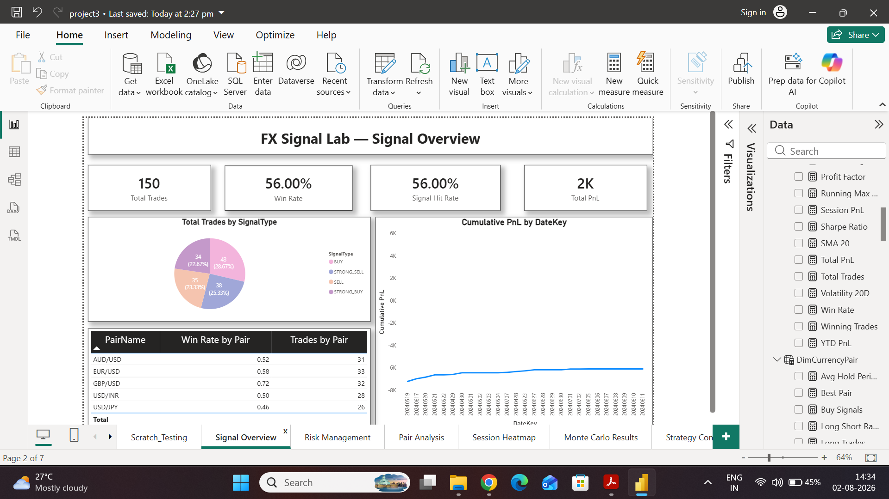
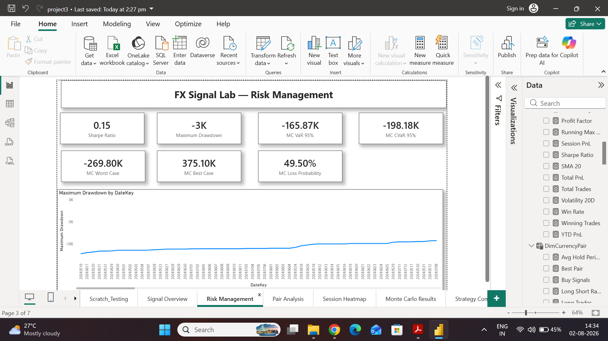
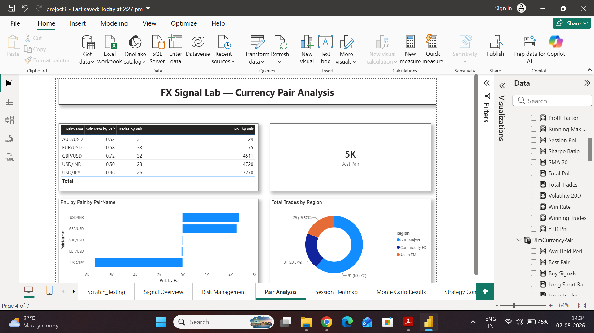
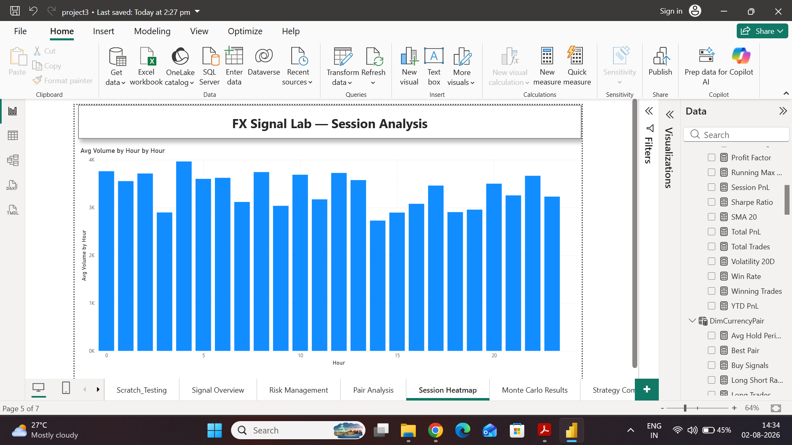
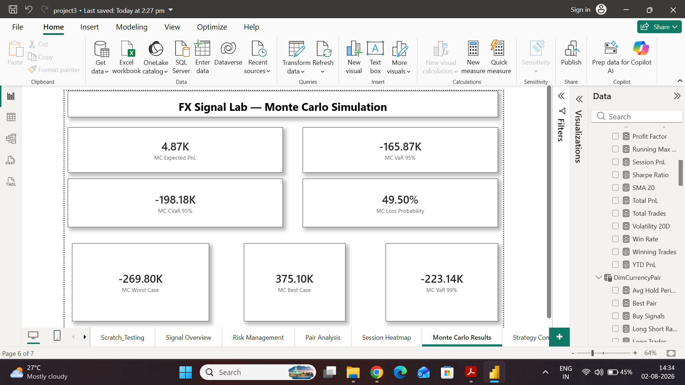
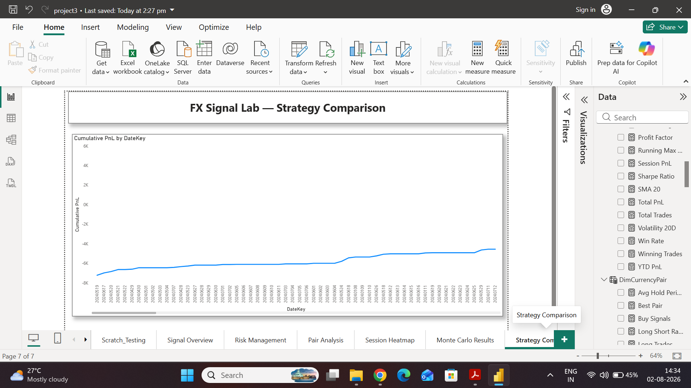
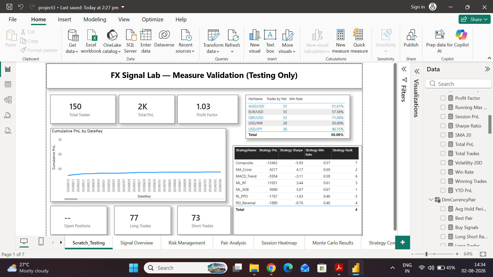

# FX Signal Lab — Forex Trading Signal (Project 1C)

## Overview
An AI-powered Forex trading signal system that generates BUY/SELL signals 
across multiple currency pairs using technical analysis, machine learning, 
and reinforcement learning. Performance is tracked through a Power BI 
dashboard suite covering signal monitoring, risk management, and 
performance attribution.

## Currency Pairs Covered
AUD/USD, EUR/USD, GBP/USD, USD/INR, USD/JPY

## Dashboard

### Signal Overview

### Risk Management

### Currency Pair Analysis

### Session Analysis (Avg Volume by Hour)

### Monte Carlo Simulation Results

### Strategy Comparison

### Measure Validation (Testing)

Full dashboard export: [FX_Signal_Lab_PowerBI_Dashboard.pdf](FX_Signal_Lab_PowerBI_Dashboard.pdf)

## Repository Contents

| File | Description |
|------|-------------|
| `FX_Signal_Lab_PowerBI_Dashboard.pdf` | Full exported Power BI dashboard (all pages) |
| `SignalOverview.png` | Signal type breakdown, win rate, hit rate, cumulative PnL |
| `RiskManagement_Drawdown.png` | Sharpe ratio, max drawdown, VaR/CVaR metrics |
| `PairAnalysis_CurrencyPairs.png` | Win rate, trades, and PnL by currency pair |
| `SessionHeatmap_AvgVolumeByHour.png` | Average trading volume by hour of day |
| `MonteCarloResults.png` | Monte Carlo simulation results (best/worst case, loss probability) |
| `StrategyComparison_CumulativePnL.png` | Cumulative PnL comparison across strategies |
| `ScratchTesting_MeasureValidation.png` | DAX measure validation and testing view |
| `forex_price_data.csv` | Historical Forex price data used for signal generation |
| `mc_scenarios.csv` | Monte Carlo simulation scenario data |
| `trade_log.csv` | Log of all executed trades with entry/exit and PnL |

## Strategies Evaluated
MA_Cross, MACD_Trend, RSI_Reversal, ML_RF (Random Forest), 
ML_XGB (XGBoost), RL_PPO (Reinforcement Learning), Composite

## Key Metrics
- **Total Trades:** 150
- **Win Rate:** 56.00%
- **Total PnL:** 2K
- **Profit Factor:** 1.03
- **Sharpe Ratio:** 0.15
- **Max Drawdown:** -3K
- **MC VaR (95%):** -165.87K
- **MC CVaR (95%):** -198.18K

## Top Performing Strategy
**ML_XGB** — PnL: 9690 | Sharpe: 5.67 | Win Rate: 0.67 | Rank: 1

## Confidentiality
This project and all related work is **STRICTLY PRIVATE & CONFIDENTIAL**, 
and remains the property of **Zetheta Algorithms Private Limited**. 
Not for public distribution, sharing, or reuse.

## Author
Samruddhi Satish Patil
