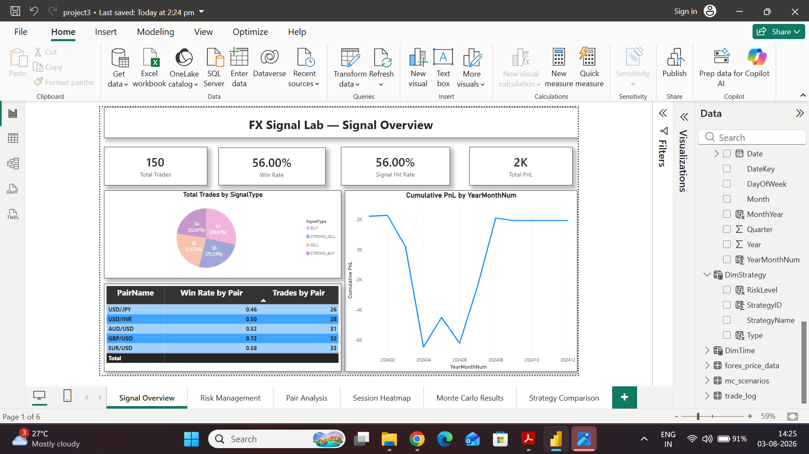
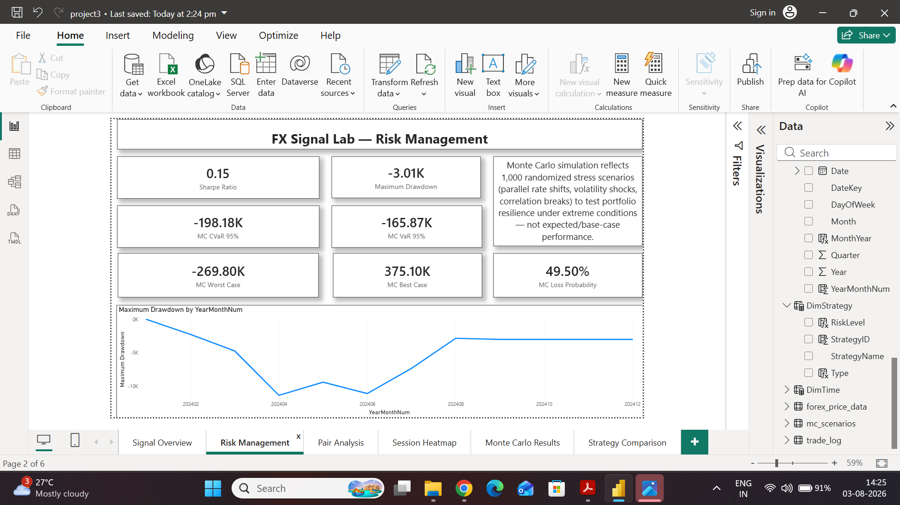
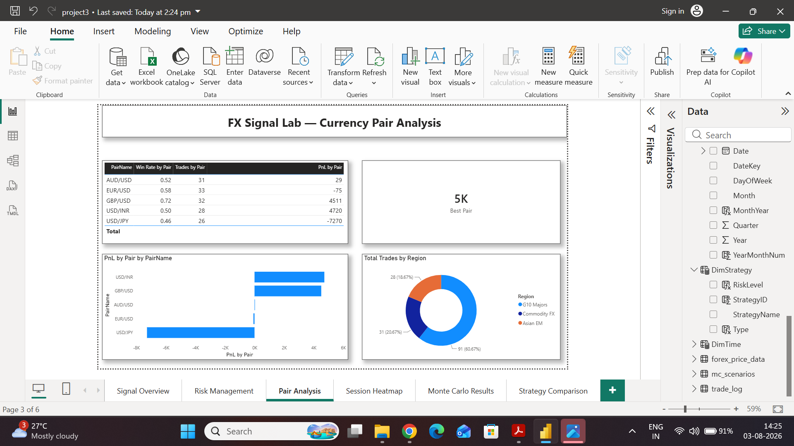
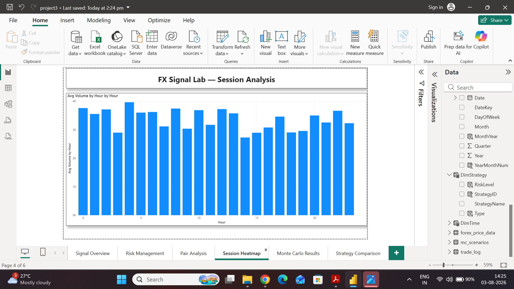
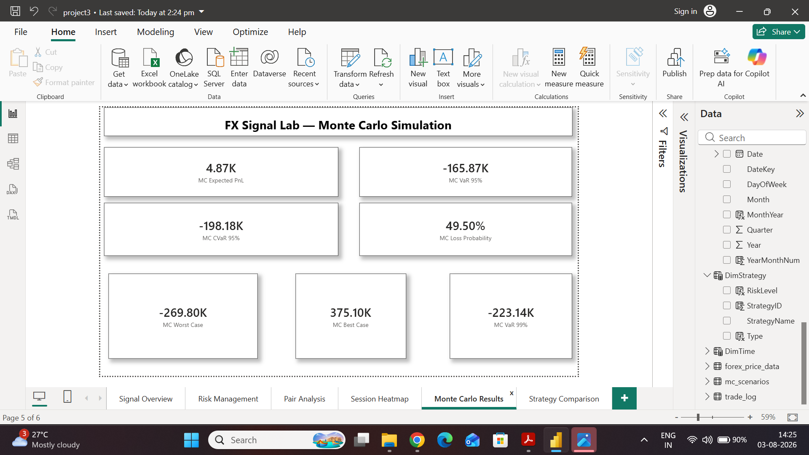
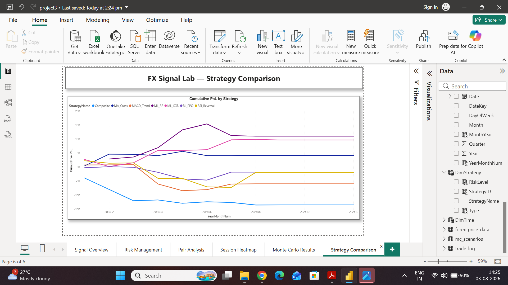

# 📊 Project-1C-Data-Analyst-Forex-Trading-Signal.

An AI-powered Forex trading signal system using reinforcement learning, technical
analysis, and machine learning models, with a comprehensive Power BI dashboard
driven by advanced DAX for real-time signal monitoring, risk management, and
performance attribution across currency pairs.

## 🎯 Overview

This project analyses a multi-pair Forex trading book (AUD/USD, EUR/USD, GBP/USD,
USD/INR, USD/JPY) generated by a combination of technical-indicator strategies
(MA Cross, MACD Trend, RSI Reversal), machine learning models (Random Forest,
XGBoost), and a reinforcement learning agent (PPO). Strategy signals, trade-level
outcomes, and Monte Carlo stress scenarios are combined into a single Power BI
dashboard to monitor signal quality, risk exposure, session-level behaviour, and
strategy performance side by side.

Built as part of a Data Analyst Forex Trading Signal project, using Power BI,
Power Query, and DAX on simulated broker/trade-log data resembling real-world
trading desk reporting.

## 🗂️ Dashboard Pages

### 1. Signal Overview
Total trades, win rate, signal hit rate, total PnL, signal-type distribution
(BUY / SELL / STRONG_BUY / STRONG_SELL), and cumulative PnL trend, plus a
win-rate-by-pair breakdown table.

### 2. Risk Management
Sharpe ratio, maximum drawdown, and Monte Carlo risk metrics (VaR 95%, CVaR 95%,
worst/best case, loss probability), with a maximum drawdown trend over time.

### 3. Currency Pair Analysis
Win rate, trade count, and PnL by currency pair, best-performing pair, and trade
distribution by region (G10 Majors, Commodity FX, Asian EM).

### 4. Session Heatmap
Average trading volume by hour of day, highlighting peak trading sessions and
liquidity windows across the 24-hour Forex cycle.

### 5. Monte Carlo Simulation
1,000-scenario stress test of the trading book — expected PnL, VaR/CVaR at 95%
and 99%, worst/best case outcomes, and overall loss probability under simulated
rate shocks and volatility shifts.

### 6. Strategy Comparison
Cumulative PnL by strategy (Composite, MA_Cross, MACD_Trend, ML_RF, ML_XGB,
RL_PPO, RSI_Reversal), enabling direct comparison of rule-based, ML-driven, and
RL-driven signal strategies over time.

## 🧮 Key DAX Techniques Used

- `CALCULATE` with signal-type and pair filters for win rate, hit rate, and PnL by segment
- `SUMX` for weighted strategy PnL and Sharpe ratio calculations
- Custom Date table with time-intelligence columns (Year, Month, Quarter, YearMonthNum) for chronological trend sorting
- `DIVIDE`-based ratio measures (Win Rate %, Signal Hit Rate %, MC Loss Probability %)
- Monte Carlo aggregation measures for VaR, CVaR, and worst/best-case scenario analysis
- Strategy-level legend breakdown for multi-series cumulative PnL comparison

## 📁 Data Sources

| File | Description |
|------|-------------|
| [`forex_price_data.csv`](forex_price_data.csv) | Historical price data across currency pairs used for signal generation |
| [`mc_scenarios.csv`](mc_scenarios.csv) | 1,000 Monte Carlo stress-test scenarios (rate shocks, volatility shifts) |
| [`trade_log.csv`](trade_log.csv) | Trade-level log — 150 trades with signal type, strategy, PnL, and pair details |

## 🛠️ Tools Used

- Power BI Desktop
- DAX (Data Analysis Expressions)
- Power Query
- Machine Learning: Random Forest, XGBoost
- Reinforcement Learning: PPO

## 📥 Dashboard File

The full Power BI dashboard is available here:
[`FX-Signal-Lab-Trading-Dashboard.pdf`](FX-Signal-Lab-Trading-Dashboard.pdf)

## 👤 Author

Samruddhi Patil

---

*Project 1C: Data Analyst Forex Trading Signal*
